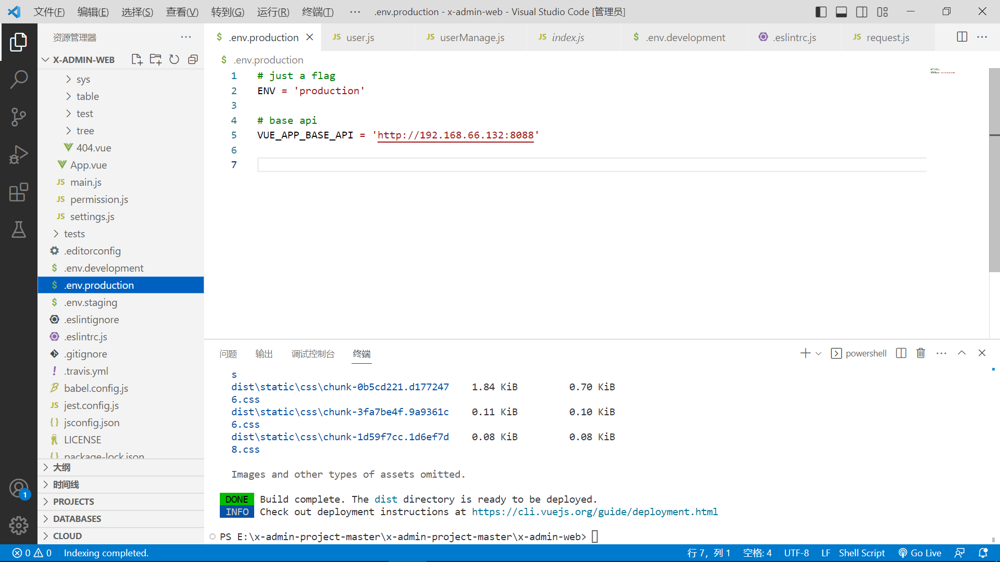
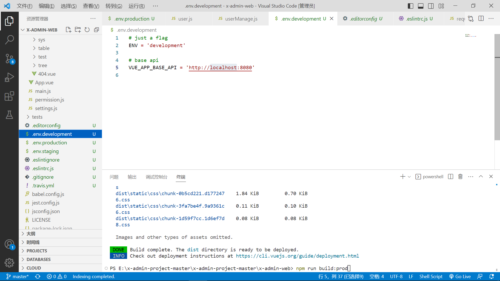
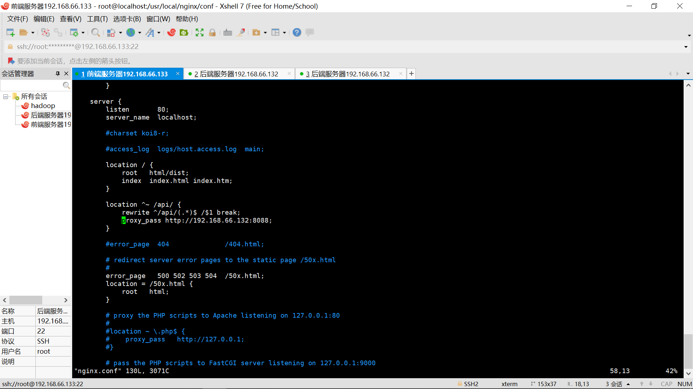
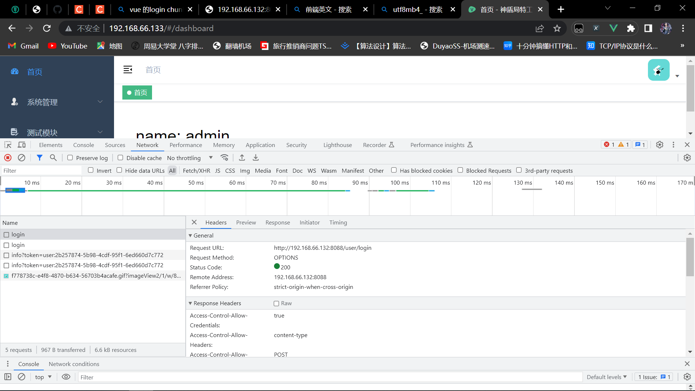
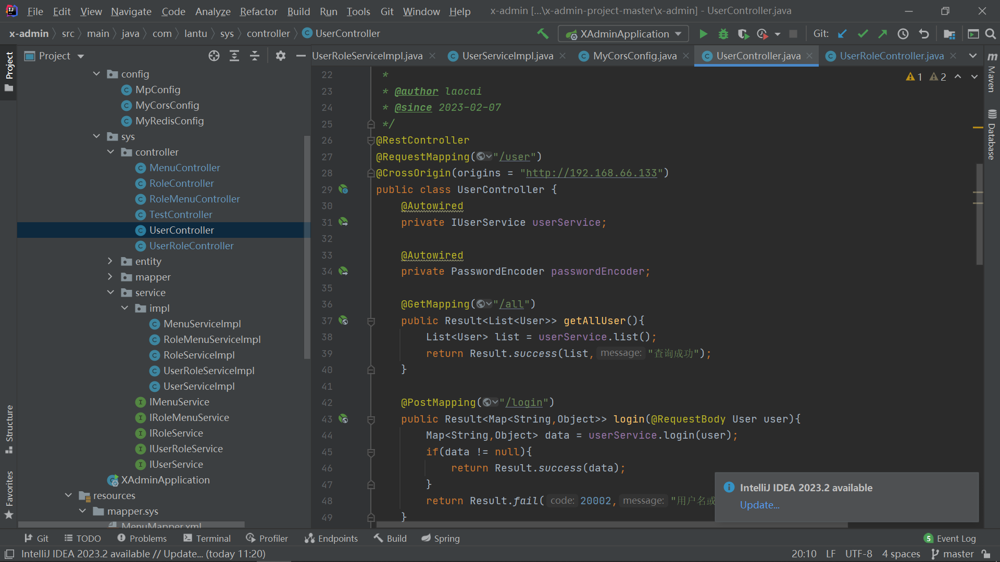
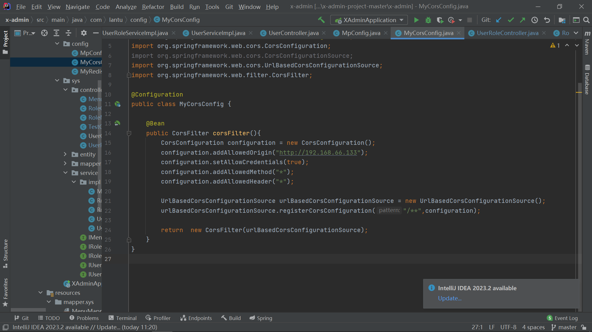
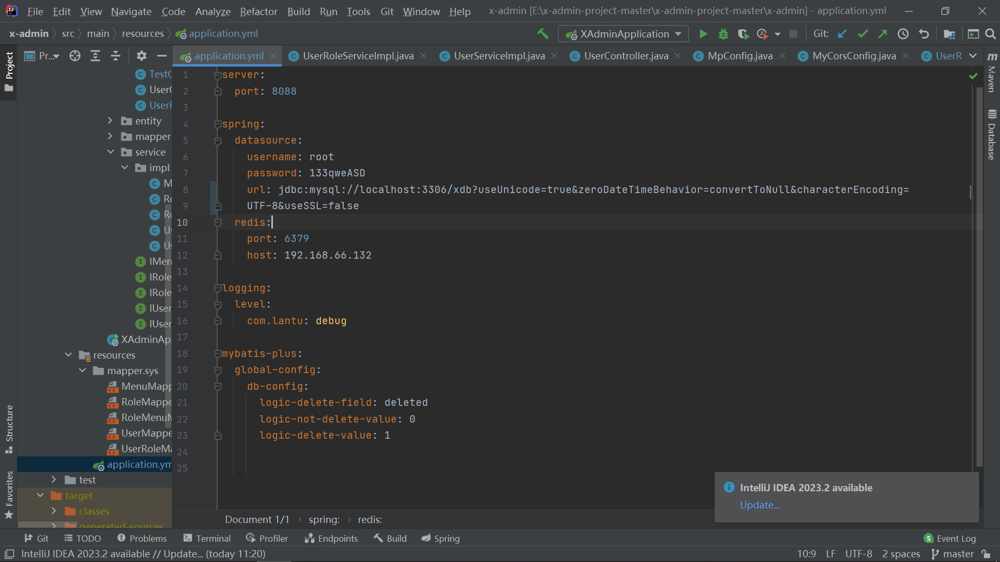

### 1:Git


如果要进行git提交时一定要先进行中间的commit然后点击右边的提交

左边是从gitee仓库进行拉取文件，提交时用户名：cr7-sherry,密码133qweASD

分支操作和tag标签不用看，暂时用不上

仓库里别有东西，idea就能提交上去

注意github里面建立readMe.md在进行提交，使用一下代码，可能得使用vpn才能提交，github有时候不好进

git那个文件夹的目录和名字不要改，否则git麻烦

[手把手教你在github上传文件_哔哩哔哩_bilibili](https://www.bilibili.com/video/BV1Xs4y1i7id/?spm_id_from=333.337.search-card.all.click&vd_source=b5a2d62f8bc81232911e324d603b1275)

```
git init
git add
git commit -m "haha" 
git remote add origin https://github.com/woaixiuer/method.git
git push -u origin master

```


### 2:linux安装（这些前后服务器里面已经全部配置)

maven下载方式（不好找到，其他需要的资源都在百度网盘里）： https://archive.apache.org/dist/maven/maven-3/3.5.4/binaries/apache-maven-3.5.4-bin.tar.gz

maven必须在含有pom.xml的工程下面才能初始化，也可以不初始化，直接配好环境用就行，

安装完centos系统时，需要进行网卡设置(瑞吉外卖-P121)，然后需要进行静态ip设置。(注意两台服务器网关和DNS要一样，如果不一样会导致连不上网，检查是否连上网就ping baidu)

访问不到linux的服务器，需要把linux上的防火墙关掉

后端服务器静态ip设置

```
BOOTPROTO="static"
IPADDR="192.168.66.132"
NETMASK="255.255.255.0"
GATEWAY="192.168.66.2"
DNS1="192.168.66.2"
```

前端服务器静态ip设置

```
BOOTPROTO="static"
IPADDR="192.168.66.133"
NETMASK="255.255.255.0"
GATEWAY="192.168.66.2"
DNS1="192.168.66.2"
```

注意，这里的静态ip时不时会出现断网的情况

解决: [解决 Linux 网络 “Job for network.service failed because the control process exite”问题_zhangbw~的博客-CSDN博客](https://blog.csdn.net/VariatioZbw/article/details/107482739)

```
service NetworkManager stop
chkconfig NetworkManager off 
service network restart
```


配置mysql(前后端服务器均已配置)

​	

```java
#修改密码
set global validate_password_policy=0; 
set global validate_password_length=1;
ALTER USER 'root'@'localhost' IDENTIFIED BY '133qweASD';

GRANT ALL PRIVILEGES ON *.* TO 'root'@'%' IDENTIFIED BY '133qweASD' WITH GRANT OPTION;

FLUSH  PRIVILEGES;
```

### 3:启动springboot

Shell脚本拉取

在此之前需要把linux上的maven的settings.xml配置

```
 <mirrors>
     <mirror>
     <id>nexus-aliyun</id>
     <mirrorOf>central</mirrorOf>
     <name>Nexus aliyun</name>
      <url>http://maven.aliyun.com/nexus/content/groups/public/</url> 
     </mirror>
 </mirrors>
<localRepository>/usr/local/repository</localRepository>
```

拉取：

```
git clone https://gitee.com/cr7-sherry/springboot-demo.git
#在浏览器访问192.168.66.132:8080/hello
cd /usr/local/shell-repo
chomd 777 bootStart-demo.sh 
./bootStart-demo.sh
```

bootStart-demo.sh内容

```
#!/bin/sh
echo =================================
echo  自动化部署脚本启动
echo =================================

echo 停止原来运行中的工程
APP_NAME=helloworld

tpid=`ps -ef|grep $APP_NAME|grep -v grep|grep -v kill|awk '{print $2}'`
if [ ${tpid} ]; then
    echo 'Stop Process...'
    kill -15 $tpid
fi
sleep 2
tpid=`ps -ef|grep $APP_NAME|grep -v grep|grep -v kill|awk '{print $2}'`
if [ ${tpid} ]; then
    echo 'Kill Process!'
    kill -9 $tpid
else
    echo 'Stop Success!'
fi

echo 准备从Git仓库拉取最新代码
cd /usr/local/springboot-demo

echo 开始从Git仓库拉取最新代码
git pull
echo 代码拉取完成

echo 开始打包
output=`mvn clean package -Dmaven.test.skip=true`

cd target

echo 启动项目
nohup java -jar demo-0.0.1-SNAPSHOT.jar &> springboot-demo.log &
echo 项目启动完成

```

### 4:MySql主从设制(两台服务器均没配置，没什么用，可以装逼)

这里如果出问题很有可能是低版本不能用高版本东西，注意mysql版本5.0和8.0以及mavem里面的依赖

### 5:Nginx(前端服务器已经配置，后端不需要配置)


访问路径nginx:192.168.66.133:80/hello.html

(在此之前需要把两台服务器的防火墙全部关闭，我已经全部关闭了，这个hello.html是自己往前端服务器传上去的，这个html位置：/nginx/html/hello.html)

nginx命令

```
cd /user/local/nginx/sbin
nginx          //启动
nginx -s stop  //关闭
nginx -s reload  //重新加载，对配置文件修改后必须重新加载后才能有效
```

nginx配置文件（原理解析）

```
  server {
        listen       80 ;                  # 监听端口
        server_name  localhost;            # 服务器名称

        location / {                       # 匹配客户端请求url
            root   html;                   # 指定静态资源根目录
            index  index.html index.htm;   # 指定默认首页
        }
    }

```

nginx(反向代理，已经配置P182,还有一种写法的反向代理没有设置，那种更好用P190)

直接在前端服务器访问192.168.66.133:82,就能跳转到后端服务器，需要配置/local/nginx/nginx.conf文件，后端需要用bootstart-demo.sh脚本提前开启springboot项目，或者手工开启springboot项目（java -jar .....)


```
server {
    listen       82 ;                  # 监听端口
    server_name  localhost;            # 服务器名称

    location / {                       # 匹配客户端请求url
       proxy_pass http://192.168.66.132:8080/hello;跳转到后端服务器，这里的hello是后端的请求路径
    }
}
```

前端

后端

### 6:前后端部署配置

#### 6.1前端:

修改这个配置就行，图中网址为你的后端服务器的ip注意端口号，下载完如果没有node_modules，就需要npm  install



前端打包时指令： npm run build:prod，会生成dist文件夹，该项目已经存到github上


这个配置是设置你windows访问后端时候跳转的base_url(与linux无关)




redis的redis.conf文件（/usr/local/redis_4.0.0/........)需要修改配置（[Redis保护模式开启问题解决 - 简书 (jianshu.com)](https://www.jianshu.com/p/a275b96572df)），如下

​    1：# bind 127.0.0.1  这个已经注释

​    2: protected-mode no  已经修改

​    3:daemonize  yes   已经改为yes(这项我没有修改，但是能正常运行)

最后最重要的一步，一定要以**redis-server --protected-mode no**在redis/src下面进行运行redis，否则还是会报500这个错误，我是在x-admin那个target目录下面的springboot-log发现一堆报错,500是因为redis没有连接上还有个原因就是后端的数据库连接失败，也是报错500，解决方法见后端注意事项。

前端的nginx最终配置文件（事实上我好像并没有用到nginx反向代理，即使将8088改成8082也能运行，核心配置可能就是vue的那个env.conf文件）



前端如果报错404，说明你前端或者后端没有开启或者是端口号和ip出现问题，如果报错403说明后端开启了但是cors跨域路由有问题，详见后端解决方法。

login登录界面信息，看remote_addr就是我后端的ip,这个只要我改env.conf文件这个后端ip就会受到改变，而我改nginx的配置文件却不会受到影响。



#### 6.2后端

后端出现403，是因为跨域没设置好，解决方法在每一个controller上面加上注解（该后端项目已经放到github上面）

注意@CrossOrigin每一个都要配置，图中配置了6个，网上说建立了MycorsConfig就不需要这么做，但是实际上还得这么做，

MycorsConfig 文件内容



个人推测这个文件没气作用可能是版本问题或者是url那里得加上端口号？


500还有可能是数据库连接失败或者redis连接失败，redis已经写了，数据库配置只需要改java文件就行



注意xdb后面那一串的东西，很重要

springboot如果在linux多次执行脚本shell.sh也会出现一个8088端口被占用的错误导致403，原因就是你开了多个脚本，把虚拟机关了重启就行，不需要改端口号
